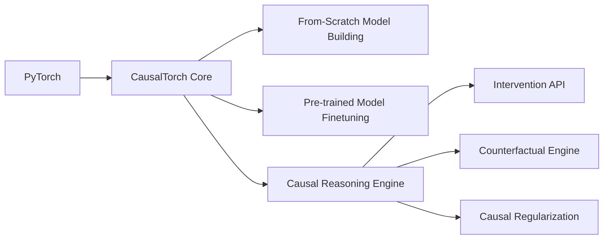

## Building a Standalone CausalTorch Library for End-to-End Causal AI Development

Based on your requirements, here's a comprehensive architecture for CausalTorch as a self-contained PyTorch-based framework that supports both from-scratch model building and fine-tuning of existing models with causal capabilities:

### Core Architecture Principles


### 1. Foundational Building Blocks

#### a) Causal Computation Layers
```python
class CausalLinear(nn.Module):
    def __init__(self, in_features, out_features, causal_mask):
        super().__init__()
        self.weight = nn.Parameter(torch.Tensor(out_features, in_features))
        self.bias = nn.Parameter(torch.Tensor(out_features))
        self.register_buffer('causal_mask', causal_mask)  # Binary mask matrix
        
    def forward(self, x):
        masked_weight = self.weight * self.causal_mask
        return F.linear(x, masked_weight, self.bias)

class CausalConv1d(nn.Conv1d):
    def __init__(self, *args, causal_mask, **kwargs):
        super().__init__(*args, **kwargs)
        self.register_buffer('causal_mask', causal_mask)
        
    def forward(self, x):
        self.weight.data = self.weight * self.causal_mask
        return super().forward(x)
```

#### b) Causal Graph Core
```python
class CausalGraph:
    def __init__(self, adjacency_matrix):
        self.adjacency = adjacency_matrix  # Tensor[float]
        self._validate_dag()
        
    def do_intervention(self, node, value):
        """Performs hard/soft intervention on a node"""
        # Implementation details
        
    def counterfactual(self, factual_data, intervention):
        """Generates counterfactual scenarios"""
        # Implementation details
        
    def to_layer_masks(self, feature_mapping):
        """Converts DAG to layer-wise masks for neural networks"""
        # Implementation details
```

### 2. Standalone Model Building System

#### Model Construction API
```python
from causaltorch import models

# From-scratch construction
model = models.CausalModel(
    graph=my_dag,
    architecture={
        'input_layer': CausalLinear(in_dim, hidden_dim),
        'hidden_layers': [
            CausalConv1d(...),
            nn.CausalAttention(...)  # Custom causal attention
        ],
        'output_layer': nn.Linear(...)
    }
)

# Pre-configured architectures
causal_vae = models.CausalVAE(
    graph=my_dag,
    latent_dim=256,
    encoder_layers=[512, 256],
    decoder_layers=[256, 512]
)
```

### 3. Causal Fine-tuning Framework

#### Fine-tuning API
```python
from causaltorch.finetune import CausalFineTuner

# Initialize with any pretrained model
finetuner = CausalFineTuner(
    base_model=pretrained_resnet50,
    causal_graph=domain_dag,
    adaptation_strategy='residual'  # Options: adapter, residual, projection
)

# Configure fine-tuning
finetuner.configure(
    trainable_components='causal_layers',  # Freeze base model
    intervention_lr=0.01,
    causal_regularization=0.1
)

# Fine-tune with causal constraints
finetuner.fit(
    train_dataloader,
    val_dataloader,
    metrics=['accuracy', 'causal_fidelity']
)
```

### 4. Causal Training Infrastructure

#### Training Manager
```python
from causaltorch.trainer import CausalTrainer

trainer = CausalTrainer(
    model=causal_model,
    optimizer=torch.optim.AdamW,
    loss_components={
        'reconstruction': nn.MSELoss(),
        'causal': CausalConsistencyLoss(),
        'dagness': DagConstraintLoss()
    },
    intervention_scheduler=IntervalScheduler(every=1000)
)

trainer.train(
    epochs=100,
    dataloader=train_loader,
    intervention_policy='adaptive'
)
```

### 5. Key Innovation: Causal Model Zoo

```python
from causaltorch.zoo import causal_models

# Pretrained causal foundation models
model = causal_models.causal_vit_l16(
    pretrained=True,
    causal_graph='commonsense_knowledge'
)

# Domain-specific models
finance_model = causal_models.causal_lstm_finance(
    pretrained=True,
    graph='macroeconomic_dag'
)
```

### 6. Production Optimization Features

1. **Causal Graph Compiler**
```python
causal_model.compile(
    backend='torchscript',
    optimization_level='O3',
    causal_inference_mode='static'
)
```

2. **Causal Quantization**
```python
quantized_model = torch.quantization.quantize_dynamic(
    causal_model,
    {CausalLinear, CausalAttention},
    dtype=torch.qint8
)
```

### 7. Validation Suite

```python
from causaltorch.validate import CausalValidator

validator = CausalValidator(model, test_dataloader)
results = validator.run_tests(
    tests=[
        'invariance',
        'counterfactual_consistency',
        'directional_accuracy',
        'intervention_effect'
    ],
    reference_graph=true_dag
)
```

### Implementation Roadmap

1. **Core Development**
   - Causal graph engine
   - Basic causal layers
   - DAG-to-network compiler
   - Intervention/counterfactual engine

2. **Training Framework**
   - Causal regularization losses
   - Intervention scheduling
   - Fine-tuning adapters

3. **Model Zoo**
   - Causal Transformers
   - Causal Diffusion Models
   - Temporal Causal Networks
   - Pretrained domain models

4. **Productionization**
   - Graph compilation
   - Quantization support
   - Deployment pipelines

5. **Validation Suite**
   - Causal metrics
   - Robustness testing
   - Edge case handling

### Key Research Integration Points

1. **Causal Representation Learning**
   - Implement differentiable causal discovery
   - Latent space causal disentanglement

2. **Neuro-Symbolic Integration**
   ```python
   from causaltorch import symbolic
    
   # Convert neural outputs to symbolic causal rules
   rule_extractor = symbolic.RuleExtractor(
       model=causal_model,
       granularity='concept_level'
   )
   ```

3. **Causal Uncertainty Quantification**
   ```python
   # Bayesian causal edges
   model.enable_uncertainty(
       method='bayesian_dropout',
       dropout_rate=0.1,
       n_samples=50
   )
   ```

This architecture positions CausalTorch as a standalone library that maintains PyTorch compatibility while providing:
- End-to-end causal model development
- Seamless fine-tuning of existing models
- Production-ready optimization
- Rigorous causal validation
- Expandable model zoo

The implementation would focus on maintaining API stability while enabling cutting-edge research through well-defined extension points.